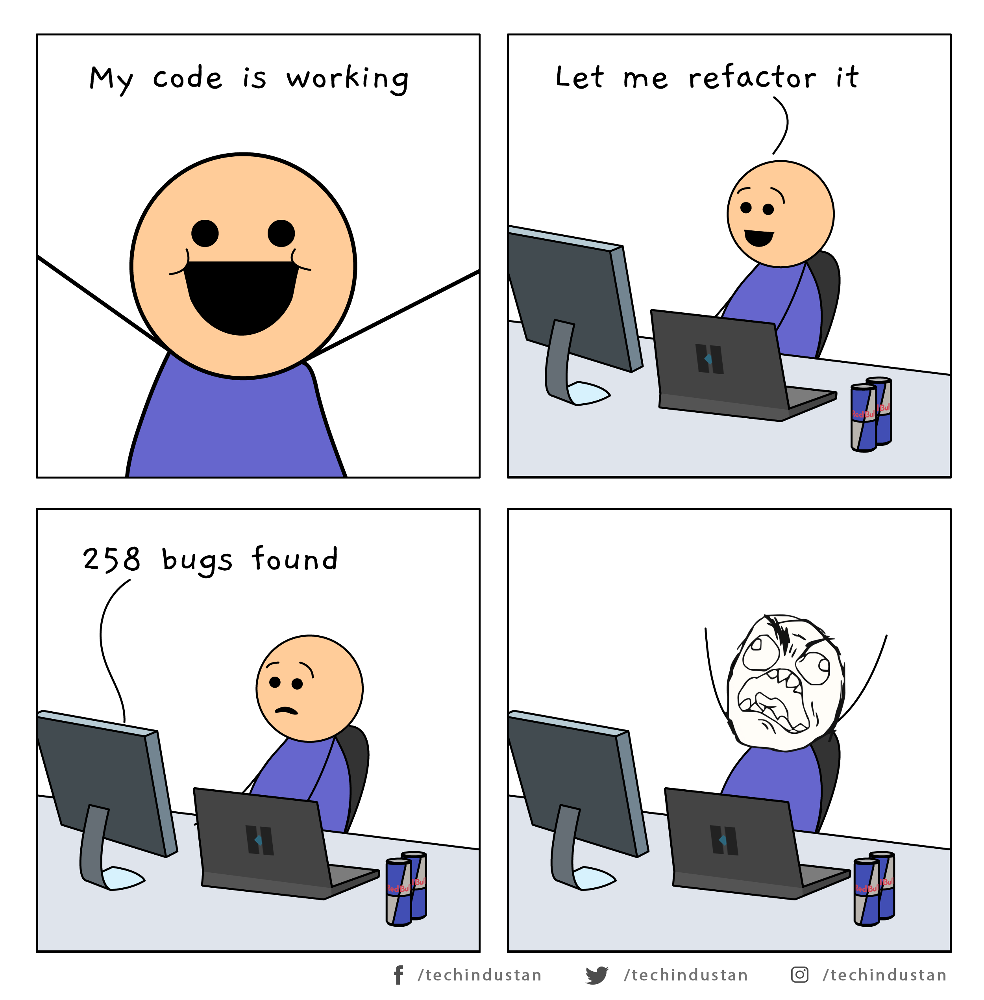

# Chapter 10: Classes

**Table of Contents**  

- [Chapter 10: Classes](#chapter-10-classes)
  - [1.1. Class Orrganization](#11-class-orrganization)
    - [1.1.1. Encapsulation (Tính đóng gói)](#111-encapsulation-t%C3%ADnh-%C4%91%C3%B3ng-g%C3%B3i)
  - [1.2. Class Should Be Small](#12-class-should-be-small)
    - [1.2.1. The Single Responsibility Principle (SRP)](#121-the-single-responsibility-principle-srp)
    - [1.2.2. Cohesion (Sự gắn kết)](#122-cohesion-s%E1%BB%B1-g%E1%BA%AFn-k%E1%BA%BFt)
  - [1.3. Maintaining Cohesion Results in Many Small Classes](#13-maintaining-cohesion-results-in-many-small-classes)
  - [1.4. Organizing for Change](#14-organizing-for-change)
    - [1.4.1. Isolating from Change](#141-isolating-from-change)

**Keywords:**

- StepDown Rule
- God Class
- Single Responsibility Principle (SRP)
- Cohesion
- Open-Closed Principle (OCP)
- Dependency Inversion Principle (DIP)
- Code organization level: line -> block -> function -> classes

## 1.1. Class Orrganization

- Theo java convention, class bắt đầu với các biến (list of variables).
- `public static` contstants nên được đặt đầu tiên, tiếp đến là các biến cục bộ (private variables).
- Rất hiếm khi bạn cần sử dụng một biến public.
- Tiếp theo danh sách biến, là các public function. Bạn đặt các `private function` (utilities function) được public function sử dụng (call) theo sau `public function` đó. => ==STEPDOWN rule==

### 1.1.1. Encapsulation (Tính đóng gói)

- Ưu tiên sử dụng `private` access modifier cho biến và utils function
- Khi các unit test cần truy cập các function hay variables này, có thể sử dụng `protected` hoặc package scope (default access modifier)
- ==Nới lỏng tính đóng gói là phương án cuối cùng==

## 1.2. Class Should Be Small

- Thế nào là một `Small` Class?
- Như chúng ta đã biết small function có thể được đo đạt bằng `counting physical lines`, vậy `Small` class sẽ được đo đạt bằng `Responsibilites`.

```java
public class SuperDashboard extends JFrame implements MetaDataUser {
  public String getCustomizerLanguagePath();
  public void setSystemConfigPath(String systemConfigPath);
  public String getSystemConfigDocument();
  public void setSystemConfigDocument(String systemConfigDocument);
  public boolean getGuruState();
  public boolean getNoviceState();
  public boolean getOpenSourceState();
  public void showObject(MetaObject object);
  public void showProgress(String s);
  public boolean isMetadataDirty();
  public void setIsMetadataDirty(boolean isMetadataDirty);
  public Component getLastFocusedComponent();
  public void setLastFocused(Component lastFocused);
  public void setMouseSelectState(boolean isMouseSelected);
  public boolean isMouseSelected();
  public LanguageManager getLanguageManager();
  public Project getProject();
  public Project getFirstProject();
  public Project getLastProject();
  public String getNewProjectName();
  public void setComponentSizes(Dimension dim);
  public String getCurrentDir();
  public void setCurrentDir(String newDir);
  public void updateStatus(int dotPos, int markPos);
  public Class[] getDataBaseClasses();
  public MetadataFeeder getMetadataFeeder();
  ...
}
```

- Class SuperDashboard có quá nhiều public method. => **GOD Class**

```java
public class SuperDashboard extends JFrame implements MetaDataUser {
  public Component getLastFocusedComponent();
  public void setLastFocused(Component lastFocused);
  public int getMajorVersionNumber();
  public int getMinorVersionNumber();
  public int getBuildNumber();
}
```

`SuperDashboard` lúc này chỉ còn **5 public method** => Vẫn chưa thể gọi `SuperDashboard` là một `small` class được, bởi vì nó vẫn có quá nhiều `responsibilities`.

- Tên của class nên phản ảnh tách dụng của nó (what responsibilites it fullfills).
- Tên của class là cách đầu tiên giúp xác định kích thước của Class -> Nếu không thể chọn 1 cái tên súc tích cho class -> Khả năng nó sẽ trở nên quá lớn.
- Tên class càng `mơ hồ` (ambiguous) thì nó càng có khả năng có càng nhiều trách nhiệm (responsibilities)

> Ex:
> Các class có tên mơ hồ dễ hiểu nhầm như `Processor`, `Super`, `Manager` thường dẫn đến tập hợp của nhiều responsibilites

- Nên viết một đoạn mô tả ngắn gọn về Class trong khoảng ==25 từ==, không sử dụng các từ `if`, `and`, `or` hoặc `but`.

**Cách mà chúng ta mô tả class `SuperDashboard`? **

> “The `SuperDashboard` provides access to the component that last held the focus, and it also > allows us to track the version and build numbers.” The first ==“and”== is a hint that > `SuperDashboard` has too many responsibilities.

Chúng ta chú ý từ ==and== => đó chính là dấu hiệu cho thấy class có quá nhiều responbilities.

### 1.2.1. The Single Responsibility Principle (SRP)

Single Responsibility Principle (SRP) là một nguyên tắc thể hiện rằng một class chỉ nên có ==một và chỉ một== responsibility.

Ta phân tích về class `Super Dashboard` có các nhiệm vụ:

- Tracks version -> Khi thay đổi version cần cập nhật nó
- Quản lý Java Swing components -> Đôi khi không thay đổi về giao diện vẫn phải cập nhật nó khi cập nhật version

Chúng ta cần xác định lại trách nhiệm của class (trying to identify responbilities - reason to change) sẽ giúp chúng ta nhìn nhận và tạo ra tính `abstractions tốt hơn`.

A single-responsibility class

```java
public class Version {
  public int getMajorVersionNumber()
  public int getMinorVersionNumber()
  public int getBuildNumber()
}
```

- SRP là một concept quan trọng của OO design, cụ thể ở đây là Class design.
- Chúng ta bắt đầu công việc với mục tiêu thông thường là làm code của mình có thể hoạt động. Đa số các lập trình viên thường không có xu hướng hoặc một số lý do nào đó mà họ không thể <mark>nhìn lại và refactoring legacy code, breaking overstuffed classes into decouped units với single responbilities</mark>.
- Nhiều lập trình viên cho rằng việc tạo ra quá nhiều classes theo những unit quá nhỏ -> Di chuyển giữa class quá nhiều để thực hiện một công việc nhỏ -> Khó hiểu. Nhưng thực tế, một hệ thống lớn có nhiều thành phần sẽ tốt hơn một hệ thống lớn chỉ có vài classes.

> Cho một ví dụ: Bạn thích một tủ có nhiều ngăn kéo, mỗi ngăn được bỏ những công cụ chuyên biệt và được đánh nhãn rõ ràng hay bạn sẽ thích một tủ chỉ có vài ngăn tủ lớn và bạn vứt tất cả mọi thứ vào đó?

- Để quản lý sự phức tạp (complexity) của các hệ thống lớn, nguyên tắc chính đó là <mark>organize</mark> -> Developer sẽ biết được nơi họ muốn, chỉ cần tập trung vào vấn đề họ cần. Một class lớn với nhiều mục đích sẽ làm ta cần hiểu quá nhiều thứ trong khi chúng ta không cần hiểu về nó tại thời điểm này.

**Tổng kết lại:**


We want our systems to be composed of
many small classes, not a few large ones. Each small class encapsulates a single responsibility, has a single reason to change, and collaborates with a few others to achieve the
desired system behaviors.


### 1.2.2. Cohesion (Sự gắn kết)

- Class nên có `ít` instance variables.
- Mỗi method class có thể có 1 hoặc nhiều varibales
- Mỗi variable được dùng bởi các phương thức riêng -> <mark>Maximally Cohesive</mark> -> Trong thực tế, khó lòng có thể thiết kế 1 class như vậy -> Chúng ta mong muốn `cohesion to be high`
- Cohension cao ->  các methods và variables phụ thuộc vào nhau và cùng phối hợp thự hiện logic của nó.

Ví dụ: `Stack.java` - một cohesive class, có 3 method, chỉ có method `size()` là sử dụng cả 2 variables

```java
public class Stack {
  private int topOfStack = 0;
  List<Integer> elements = new LinkedList<Integer>();

  public int size() {
    return topOfStack;
  }

  public void push(int element) {
    topOfStack++;
    elements.add(element);
  }

  public int pop() throws PoppedWhenEmpty {
    if (topOfStack == 0) {
      throw new PoppedWhenEmpty();
    }

    int element = elements.get(--topOfStack);
    elements.remove(topOfStack);
    return element;
  }
}
```

- <mark>Chiến lược giữ cho `function small` và giữ cho `parameter lists short` cho thể dẫn đến vấn đề có nhiều variables phát sinh được sử dụng bởi các method con. Khi vấn đề này phát sinh, chắc chắn sẽ có ít nhất 1 class cần được tách ra khỏi Large class. Bạn nên thử tách các variables và methods ra thành 2 hoặc nhiều class để có được sự gắn kết cao (more cohesive).</mark>

## 1.3. Maintaining Cohesion Results in Many Small Classes

- ==Một large function được breaking thành các function con -> Có thể gây ra một sự gia tăng số Class==
- Giả sử large function bạn muốn tách nhỏ có nhiều variables, một function con có thể phải pass 4 parameters cho function này. Giải pháp hạn chế việc hàm có quá nhiều prams là đưa các variable này trở thành instance variables của class -> `CLASS LOSE COHESION` -> <mark>Chia tách Class</mark>


Tóm lại:
- Khi chia tách các large function sẽ cho ta cơ hội để chia tách Class -> Source code sẽ trở nên có tính tổ chức tốt hơn và trong suốt hơn.


## 1.4. Organizing for Change

- Các cả các hệ thống luôn luôn thay đổi theo thời gian -> Bất kỳ thay đổi trên 1 thành phần nào của hệ thống có thể dẫn đến các rủi ro lỗi mà không thể kiểm soát được.
- Một `CLEAN SYSTEM` thể hiện ở việc tổ chức classes để làm giảm thiểu tính rủi ro này.



A class that must be opened for change

```java
  public class Sql {
  public Sql(String table, Column[] columns)
  public String create()
  public String insert(Object[] fields)
  public String selectAll()
  public String findByKey(String keyColumn, String keyValue)
  public String select(Column column, String pattern)
  public String select(Criteria criteria)
  public String preparedInsert()
  private String columnList(Column[] columns)
  private String valuesList(Object[] fields, final Column[] columns)
  private String selectWithCriteria(String criteria)
  private String placeholderList(Column[] columns)
}
```

- Class `Sql` trên chưa hỗ trợ hàm `update()`, nó cho ta một cơ hội để modify class này -> Tìm ẩn bugs khi sửa đổi class -> Buộc phải kiểm tra toàn bộ

- Khi sử đổi Class để phục vụ các yêu cầu mới -> **Khả năng phá vỡ SRP**

- Chú ý class `Sql` có các phương thức `private` như `selectWithCriteria` thực chất chỉ hỗ trợ `select statements`

**Phương án:**

A set of closed classes

```java
abstract public class Sql {
  public Sql(String table, Column[] columns)
  abstract public String generate();
}
public class CreateSql extends Sql {

  public CreateSql(String table, Column[] columns)

  @Override
  public String generate()

}
public class SelectSql extends Sql {

  public SelectSql(String table, Column[] columns)

  @Override
  public String generate()

}
public class InsertSql extends Sql {

  public InsertSql(String table, Column[] columns, Object[] fields)

  @Override
  public String generate()

  private String valuesList(Object[] fields, final Column[] columns)

}

public class SelectWithCriteriaSql extends Sql {
  public SelectWithCriteriaSql(String table, Column[] columns, Criteria criteria)

  @Override
  public String generate()
}

public class SelectWithMatchSql extends Sql {
    public SelectWithMatchSql(String table, Column[] columns, Column column, String pattern)

    @Override
    public String generate()
}

public class FindByKeySql extends Sql {

  public FindByKeySql(String table, Column[] columns, String keyColumn, String keyValue)

  @Override
  public String generate()

}

public class PreparedInsertSql extends Sql {
  public PreparedInsertSql(String table, Column[] columns)

  @Override
  public String generate()

  private String placeholderList(Column[] columns)
  }
}

public class Where {
  public Where(String criteria)
  public String generate()
}

public class ColumnList {
  public ColumnList(Column[] columns)
  public String generate()
}
```

- Với cách tổ chức này, khi ta thực hiện bổ sung hàm `update`, không có class cần được thay đổi. Logic của `update` sẽ được đặt trong một subclass mới của Sql với tên `UpdateSql` -> Hệ thống không bị break thì sự thay đổi này.

- Tái cấu trúc `Sql` logic hỗ trợ SRP, đồng thời cũng hỗ trợ các tiêu chuẩn thiết kế khác của OO như <mark>Open-Closed Principle (OCP) - Class nên mở cho extension và đóng đối với modification</mark>


**Tóm lại:**
- Trong một hệ thống lý tưởng, ta kết hợp các tính năng mới bằng cách mở rộng hệ thống, chứ không phải bằng cách sửa đổi code hiện tại.


### 1.4.1. Isolating from Change

- `Concrete Classes` chứa implementation details (code) và `Abstract Classes` chỉ thể hiện các concepts. Một `Client Class` phụ thuộc vào `Conrete Details` có thể dẫn đến nguy hiểm (risk) khi details change. -> <mark> Vì vậy, interfaces và abstract classes ra đời để giúp chúng ta cô lập (tách rời) các tác động đến details</mark>.

- <mark>Sự phụ thuộc vào `concrete details` sẽ phát sinh nhiều thử thách trong kiểm thử.</mark>

**Ví dụ:**

- `Portfolio` class phụ thuộc vào `TokyoStockExchange` API để có được các portfolio's value. Rất khó để viết test khi, chúng ta nhận về nhiều giá trị khác nhau mỗi năm phút. Thay vào đó, ta thiết kế `Portfolio` không phụ thuộc trực tiếp vào `TokyoStockExchange`, ta tạo `StockExchange` interface:

```java
public interface StockExchange {
  Money currentPrice(String symbol);
}
```

- `currrentPrice` của interface `StockExchange` đại diện cho một `abstract concept`, nó tách biệt giữa specific details để có được một price, cách mà nó liên lạc để có được. Class `Portfolio` không cần quan tâm điều này.

```java
public Portfolio {
  private StockExchange exchange;
  public Portfolio(StockExchange exchange) {
    this.exchange = exchange;
  }
// ...
}
```

Test:

```java
public class PortfolioTest {
  private FixedStockExchangeStub exchange;
  private Portfolio portfolio;

  @Before
  protected void setUp() throws Exception {
    exchange = new FixedStockExchangeStub();
    exchange.fix("MSFT", 100);
    portfolio = new Portfolio(exchange);
  }

  @Test
  public void GivenFiveMSFTTotalShouldBe500() throws Exception {
    portfolio.add(5, "MSFT");
    Assert.assertEquals(500, portfolio.value());
  }
}
```

- Nếu một hệ thống đủ `decoupled`, nó sẽ trở nên linh hoạt (flexible) và dễ dàng tái sử dụng (reuse). `Isolation` làm cho nó dễ dàng hơn để hiểu mỗi phần tử (element) của hệ thống.

- Giảm thiểu các khớp nối (coupling) theo cách trên, các classes của ta có thể sử dụng các nguyên tắc thiết kế như <mark>Dependency Inversion Principle (DIP)</mark>. DIP đưa ra nguyên tắc: classes nên phụ thuộc vào abstractions, không phụ thuộc vào chi tiết cụ thể (concrete detail - đây có thể hiểu là implemented).
