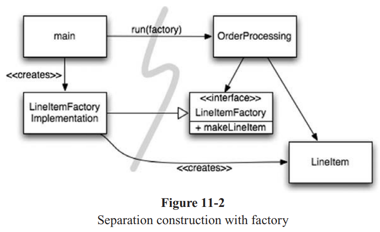
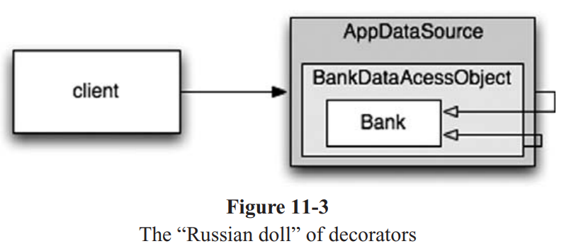

# Chapter 11: Systems

**Table of Contents**

- [Chapter 11: Systems](#chapter-11-systems)
  - [How Would You Build a City?](#how-would-you-build-a-city)
  - [Separate Constructing a System from Using It](#separate-constructing-a-system-from-using-it)
    - [Separation of Main](#separation-of-main)
    - [Factories](#factories)
    - [Dependency Injection](#dependency-injection)
  - [Scaling Up](#scaling-up)
    - [Cross-Cutting Concerns](#cross-cutting-concerns)
  - [Java Proxies](#java-proxies)
  - [Pure Java AOP Frameworks](#pure-java-aop-frameworks)
  - [AspectJ Aspects](#aspectj-aspects)
  - [Test Drive the System Architecture](#test-drive-the-system-architecture)
  - [Optimize Decision Making](#optimize-decision-making)
  - [Use Standards Wisely, When Thay Add Demonstrable Value](#use-standards-wisely-when-thay-add-demonstrable-value)
  - [Conclusion](#conclusion)

<!-- END doctoc generated TOC please keep comment here to allow auto update -->

## How Would You Build a City?

- Bạn không thể quản lý tất cả chi tiết. Một thành phố muốn hoạt động phải được điều hành bởi 1 hệ thống phân cấp, chia làm nhiều team quản lý, có một số người quản lý ở tầm bao quát `big picture` -> Đặc tính thể hiện của `abstraction` và `modulary`. Các `component` hoạt động dưới sự quản lý một cách hiệu quả mà không cần sự hiểu biết về toàn bộ. -> Software team cũng thường được tổ chức như vậy!
- Clean Code giúp chung ta đạt được các level abstraction ở mức thấp. Tại phần này, chúng ta sẽ thảo luận về clean code ở level cao hơn đó là <mark>System Level</mark>.

## Separate Constructing a System from Using It

- Quá trình xây dựng (construction) sẽ rất khác so với quá trình sử dụng (use).

> <mark>Software systems should separate the startup process, when the application objects are constructed and the dependencies are “wired” together, from the runtime logic that takes over after startup.</mark>

- Startup Process là một concern (mối quan tâm) mà bất cứ ứng dụng nào cũng phải có. Nhưng nhiều ứng dụng lại không tách rời Startup Process

```java
public Service getService() {
  if (service == null)
    service = new MyServiceImpl(...); // Good enough default for most cases?
  return service;
}
```

- Hàm `getService` ở trên đã `hard-coded`, nó phụ thuộc vào `MyServiceImpl` -> Ta không thể comple nếu không resolve được dependencies này, thậm chí nó sẽ không được sử dụng trong thời gian `runtime`.

- Sử phụ thuộc vào `MyServiceImpl` rất nguy hiểm, nếu nó là một heavyweight object -> Khó khăn trong viết test, phá vỡ nguyên tắc SRP.


We should modularize this process separately from the normal runtime logic and we should make sure that we have a global, consistent strategy for resolving our major dependencies.


### Separation of Main

- Một cách để tách `construction from use` là di chuyển tất cả các khía cạnh của construction đến `main` hoặc một module `main` và thiết kế phần còn lại của hệ thống xem như mọi objects đã được constructed và liên kết cần thiết với nhau. -> Dễ dàng flow. `Main` functions build các object cần thiết cho hệ thống và cung cấp chúng cho ứng dụng để sử dụng.


### Factories

- <mark>When</mark> - Khi nào một object được tạo ?

> Ví dụ: Một hệ thống quản lý bán hàng, cần đảm bảo rằng ứng dụng `LineItem` instances để thêm vào một `Order` -> <mark>ABSTRACT FACTORY PATTERN</mark> sẽ cho phép ứng dụng của bạn điều khiển <mark>WHEN</mark> - khi nào - cần build LineItems, nhưng sẽ giữ `the details of construction` tách biệt với application code.



- Ta nhận thấy rằng, tất cả phụ thuộc từ `main` đã được sử dụng bởi `OrderProcessing` -> Điều này có nghĩa rằng, application đã được <mark>decoupled</mark> với details - cách mà `LineItem` được tạo.

### Dependency Injection

- <mark>A powerful mechanism for separating construction from use is **Dependency Injection (DI)**,
the application of **Inversion of Control (IoC)** to dependency management.</mark>

- Chuyển giao trách nhiệm quản lý phụ thuộc -> Đáp ứng SRP

- Các vấn đề về `LAZY-INITIALIZATION` đều được các <mark>DI Container</mark> hỗ trợ thông qua `factories` hoặc `constructing proxy`.

## Scaling Up

- Quay trở lại ví dụ về sự phát triển của 1 thành phố, dân cư tăng, số khu định cứ tăng, các tòa nha cũ sẽ thay thế bằng tòa nhà chọc trời, thêm vào các dịch vụ điện, nước, internet -> Không có sự tặng trưởng nào mà không đau đớn, có bao giờ bạn tự hỏi: _Tại sao họ không xây dựng một con đường đủ lớn ngay từ đầu thay vì phải nới rộng nó về sau?_

- <mark>Sẽ không có `systems right the first time.`, thay vào đó chúng ta nên thực hiện `today's stories` và sau đó thực hiện `refactoring` and `expand` system để đáp ứng `new stories` vào ngày mai.</mark>

- Test-driven development, refactoring, and the clean code they produce make this work at the code level

- Software systems are unique compared to physical systems. Their architectures can grow incrementally, if we maintain the proper separation of concerns.

**Một ví dụ của kiến trúc không tách rời các conern hợp lý:** EJB1 à EJB2

An EJB2 local interface for a Bank EJB

```java
package com.example.banking;
import java.util.Collections;
import javax.ejb.*;

public interface BankLocal extends java.ejb.EJBLocalObject {
  String getStreetAddr1() throws EJBException;
  String getStreetAddr2() throws EJBException;
  String getCity() throws EJBException;
  String getState() throws EJBException;
  String getZipCode() throws EJBException;
  void setStreetAddr1(String street1) throws EJBException;
  void setStreetAddr2(String street2) throws EJBException;
  void setCity(String city) throws EJBException;
  void setState(String state) throws EJBException;
  void setZipCode(String zip) throws EJBException;
  Collection getAccounts() throws EJBException;
  void setAccounts(Collection accounts) throws EJBException;
  void addAccount(AccountDTO accountDTO) throws EJBException;
}
```

The corresponding EJB2 Entity Bean Implementation

```java
package com.example.banking;
import java.util.Collections;
import javax.ejb.*;
public abstract class Bank implements javax.ejb.EntityBean {
  // Business logic...
  public abstract String getStreetAddr1();
  public abstract String getStreetAddr2();
  public abstract String getCity();
  public abstract String getState();
  public abstract String getZipCode();
  public abstract void setStreetAddr1(String street1);
  public abstract void setStreetAddr2(String street2);
  public abstract void setCity(String city);
  public abstract void setState(String state);
  public abstract void setZipCode(String zip);
  public abstract Collection getAccounts();
  public abstract void setAccounts(Collection accounts);
  
  public void addAccount(AccountDTO accountDTO) {
    InitialContext context = new InitialContext();
    AccountHomeLocal accountHome = context.lookup("AccountHomeLocal");
    AccountLocal account = accountHome.create(accountDTO);
    Collection accounts = getAccounts();
    accounts.add(account);
  }
  // EJB container logic
  public abstract void setId(Integer id);
  public abstract Integer getId();
  public Integer ejbCreate(Integer id) { ... }
  public void ejbPostCreate(Integer id) { ... }
  // The rest had to be implemented but were usually empty:
  public void setEntityContext(EntityContext ctx) {}
  public void unsetEntityContext() {}
  public void ejbActivate() {}
  public void ejbPassivate() {}
  public void ejbLoad() {}
  public void ejbStore() {}
  public void ejbRemove() {}

}
```

- An entity bean is an in-memory representation of relational data, in other words, a table row 

<mark>// TODO: Phân tích kỹ hơn về kiến trúc của EJB2 lợi ích và hạn chế</mark>


### Cross-Cutting Concerns

- EJB2 architecture đã gần đạt đến tính đúng đắn của việc tách các concerns ở một số vùng. Ví dụ: các vấn đề về transtactional, security, một vài persistence behaviors được khai báo trong deployment descriptors và `độc lập với source code`.

- `Concerns` giống như việc cắt ngang giữa `natural object` và `domain` trong persitence. Bạn muốn `persist` tất cả object sử dụng một chiến lượng chung.

- `cross-cutting concerns`

- Trong thực tế, EJB architecture handled persistence, security và transactions "anticipated" `aspect-oriented programming (AOP)`

- Trong AOP, modular constructs được gọi là các khía cạnh (aspects) - là các điểm trong hệ thống nên có các behavior của nó và hỗ trợ một particular concern.

- Dùng Persistence là một ví dụ, bạn sẽ khai báo object, attributes (hoặc patterns) cần được persited và sau đó ủy thác (delegate) persistence tasks này đến persistence framework


<mark>**Let us look at three aspects or aspect-like mechanisms in Java**</mark>

## Java Proxies

- `Java Proxies` là phương pháp thích hợn cho các trường hợp đơn giản. Tuy nhiên, `dynamic proxies` cung cấp bởi JDK chỉ làm việc với interfaces. Để proxy classes, bạn phải dùng một thư viện `byte-code manipulation` như CGLIB, ASM, Javassit,...

Ví dụ về JDK proxy, cung cấp persistence support cho ứng dụng `Bank`, chỉ cover các method get/set danh sách accounts.

**Bank.java**

```java
// Bank.java (suppressing package names...)
import java.utils.*;
// The abstraction of a bank.
public interface Bank {
  Collection<Account> getAccounts();
  void setAccounts(Collection<Account> accounts);
}
```

**BankImpl.java**

```java
// BankImpl.java
import java.utils.*;
// The “Plain Old Java Object” (POJO) implementing the abstraction.
public class BankImpl implements Bank {
  private List<Account> accounts;
  public Collection<Account> getAccounts() {
    return accounts;
  }
  public void setAccounts(Collection<Account> accounts) {
    this.accounts = new ArrayList<Account>();
    for (Account account: accounts) {
      this.accounts.add(account);
    }
  }
}
```

**BankProxyHandler.java**

```java
// BankProxyHandler.java
import java.lang.reflect.*;
import java.util.*;

// “InvocationHandler” required by the proxy API.
public class BankProxyHandler implements InvocationHandler {
  private Bank bank;
  public BankHandler (Bank bank) {
    this.bank = bank;
  }
  // Method defined in InvocationHandler
  public Object invoke(Object proxy, Method method, Object[] args) throws Throwable {
    String methodName = method.getName();
    if (methodName.equals("getAccounts")) {
      bank.setAccounts(getAccountsFromDatabase());
      return bank.getAccounts();
    } else if (methodName.equals("setAccounts")) {
      bank.setAccounts((Collection<Account>) args[0]);
      setAccountsToDatabase(bank.getAccounts());
      return null;
    } else {
    ...
    }
  }
  // Lots of details here:
  protected Collection<Account> getAccountsFromDatabase() { ... }
  protected void setAccountsToDatabase(Collection<Account> accounts) { ... }
}
```

```java
// Somewhere else...
Bank bank = (Bank) Proxy.newProxyInstance(Bank.class.getClassLoader(), new Class[] { Bank.class }, new BankProxyHandler(new BankImpl()));
```

- `Bank` interface sẽ được `wrapped` bởi một proxy, và BankImpl (POJO) sẽ implement Business logic

- Proxy API yêu cầu một `InvocationHandler` object để gọi đến medthod được `implement` của `Bank` thông qua một proxy. `BankProxyHander` sử dụng Java reflection API để map một `generic method` đến một method đáp ứng yêu cầu tại `BankImpl`.

- Đoạn code trên dài dòng, phức tạp -> Khó `clean code`

- Proxy không cung cấp một cơ chế cho việc xác định `execution point` trên toàn hệ thống -> AOP là giải pháp cho yêu cầu này.

## Pure Java AOP Frameworks

- Proxies được sử dụng trọng một vài Java Framework như `Spring AOP`, `JBoss AOP` để implement các `aspect` trong `PURE JAVA` - “Pure Java” means without the use of AspectJ

- Đối với Spring, bạn thực hiện viết business logic bởi POJO một các `purely`, chỉ tập trung vào `their domain`. Không có phụ thuộc vào 1 enterprise framework

- Bạn có thể `cross-cutting concerns` như: persistence, transaction, security, caching, failover sử dụng file config hoặc APIs. Trong nhiều trường hợp, bạn có thể sử dụng Spring hoặc JBoss libary aspects - sử dụng cơ chế Java Proxies or byte-code libraries.



- Mỗi `bean` một búp bê được lồng trong một búp bê khác - “Russian doll” 

- With a domain object for a `Bank` **proxied (wrapped)** by a data accessor object (DAO), which is itself proxied by a JDBC driver data source

- Bạn có thể thêm vào các <mark>DECORATOR</mark> của transactions, caching,...

- Đối với Spring, sử dụng cơ chế DI, ta cần hỏi DI Container về object, kết hợp các Annotaion (XML vẫn là 1 lựa chọn nhưng phức tạp hơn) -> <mark>The application is almost
completely decoupled from Spring</mark> -> The code is clean, clear, and hence easy to test drive, maintain, and
so on.

## AspectJ Aspects

- `AspectJ language` là một phần mở rộng của Java (Extension of Java) cung cấp "first-class" hỗ trợ các aspect như cấu trúc module.

- Pure Java cung cấp cấp các kỹ thuật như Spring AOP, Jboss AOP có thể đáp ứng được 80-90% các trường hợp mà sử dụng aspect hữu ích nhất.

- AspectJ mạnh mẽ và cung cấp đa dạng công cụ để `separating concerns`, tuy nhiên bạn phải học các công cụ mới, ngôn ngữ mới và cách sử dụng nó.

## Test Drive the System Architecture

- If you can write your application’s domain logic using POJOs, decoupled from any architecture concerns at the code level, then it is <mark>possible to truly test drive your architecture.</mark>

- Bạn có thể tiến hóa sản phẩm từ `simple` đến `sophisticated` khi cần thiết bằng cách áp dụng công nghệ mới theo nhu cầu (on-demand). Điều này không cần thiết khi thực hiện một <mark>Big Design Up Front - BDUF</mark>. BDUF đôi khi còn có hại vì nó <mark>ngăn chặn khả năng thay đổi</mark>

- <mark>Software has its own physics</mark>, nó hoàn toàn có thể được thay đổi một các triệt để nếu như cấu trúc của ứng dụng được tách biệt các concern một cách hiệu quả.

- Chúng ta bắt đầu một software project theo một cách `ngây thơ - đơn giarn` (naively simple) nhưng có kiến trúc tách rời tốt (nicely decoupled architecture), chuyển giao các chức năng theo user stories một cách nhanh chóng và sau đó thêm nhiều infrastructure khi chúng ta scale up

- <mark>Giảm thiếu tối đa phụ thuộc trong thiết kế (minimal coupled design)</mark> ở mỗi cấp độ của `abstraction` và `scope`

- We must maintain the ability to change course in response to evolving circumstances


Tóm lại:
- An optimal system architecture consists of modularized domains of concern, each of which is implemented with Plain Old Java (or other) Objects. The different domains are integrated together with minimally invasive (xâm lấn) Aspects or Aspect-like tools. This architecture can be test-driven, just like the code.


## Optimize Decision Making

- Modularity and separation of concerns make decentralized management and decision making possible

- Trong các dự án lớn, không một cá nhân nào có thể quyết định tất cả

- Một quyết định sớm là một quyết định được thực hiện với kiến ​​thức tối ưu. Tốt nhất nên <mark>postpone decisions until the last possible moment</mark> -> Đó không phải là sự lười biếng hay thiếu trách nhiệm -> Giúp ta có những quyết định tỉnh tảo và đầy đủ thông tin nhất


Tóm lại:
- The agility provided by a POJO system with modularized concerns allows us to make optimal, just-in-time decisions, based on the most recent knowledge. The complexity of these decisions is also reduced.


## Use Standards Wisely, When They Add Demonstrable Value (Dùng standards một cách khôn ngoan)

- Construction is a mature industry with `highly optimized parts`, `methods`, and `standards` that have evolved under pressure for centuries.

- <mark>Chú ý tập trung vào giá trị cho khách hàng, giá trị về mặt nghiệp vụ, cân đối các yếu tố</mark>. EJB2 architecture vẫn được nhiều team sử dụng vì nó là một chuẩn đơn giản, dễ dùng và hiệu quả. (Tuy vẫn còn nhiều yếu tố chưa thực sự tốt)


Standards make it easier to reuse ideas and components, recruit people with relevant experience, encapsulate good ideas, and wire components together.
However, the process of creating standards can sometimes take too long for industry to wait, and some standards lose touch with the real needs of the adopters they are intended to serve.


## Systems Need Domain-Specific Languages

- Nhiều hệ thống đặc thù về domain -> `rich language` với vocabulary, idoms, patterns -> Rõ ràng, ngắn gọn

- `Domain-Specific Languages (DSLs)` = separate, small scripting languages or APIs in standard languages 

- A good DSL minimizes the “communication gap” between a domain concept and the code that implements it, just as agile practices optimize the communications within a team and with the project’s stakeholders. -> here is less risk that you will incorrectly translate the domain into the implementation

- DSLs, when used effectively, raise the abstraction level above code idioms and design patterns. They allow the developer to reveal the intent of the code at the appropriate level of abstraction.


Domain-Specific Languages allow all levels of abstraction and all domains in the application to be expressed as POJOs from high-level policy to low-level details.


## Conclusion

- <mark>System cũng cần phải clean</mark>

- <mark>At all levels of abstraction, the intent should be clear</mark>. Điều này sẽ chỉ xảy ra nếu bạn tạo ra POJOs và bạn sử dụng cơ chế aspect-like để kết hợp implement các concerns một cách không chồng chéo - xâm lấn nhau (noninvasively)

- <mark>Whether you are designing systems or individual modules, never forget to use the simplest thing that can possibly work</mark>