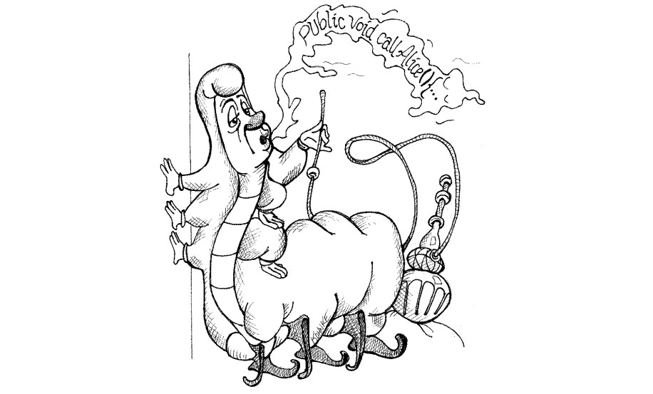

# Chapter 3: Functions

## Small!
Nguyên tắc thứ nhất: function nên nhỏ. Nguyên tắc thứ hai: function nên nhỏ hơn thế nữa.

Function phải ngắn hơn 20 dòng. Mỗi dòng phải chứa không quá 100 ký tự. Điều này làm cho mỗi function trở rõ ràng, dễ hiểu, dễ debug.
### Blocks and Indenting
Những khối câu lệnh trong `if, else, while, for, ...` nên chỉ chứa 1 dòng. Đây rất có thể là 1 lời gọi hàm. Điều này không chỉ giúp hàm trở nên nhỏ hơn mà nó còn làm tài liệu có giá trị vì hàm được gọi bên trong block có 1 cái tên miêu tả rất đẹp.

Hàm không nên đủ lớn để chứa các cấu trúc lồng nhau. Bởi vậy, mức độ thụt lề của hàm không nên quá 1 hoặc 2.

**<p style="color: #f44336">Bad</p>**
```java
public void sayHello() {
    if (/*...*/) {
        if {
            //...
        } else {
            //...
        }
    }
}
```
**<p style="color: #4caf50">Good</p>**
```java
public void sayHello() {
    if (/*...*/) {
        doSomething();
    }
}

private void doSomething() {
    if {
        //...
    } else {
        //...
    }
}
```
## Do One Thing
>FUNCTIONS SHOULD DO ONE THING. THEY SHOULD DO IT WELL. THEY SHOULD DO IT ONLY.

Cho đoạn code sau:
```java
public static String renderPageWithSetupsAndTeardowns(PageData pageData, boolean isSuite) throws Exception {
    if (isTestPage(pageData))
        includeSetupAndTeardownPages(pageData, isSuite);
    return pageData.getHtml();
 }
 ```
Đoạn code này `do one thing` hay `do three things`?

- Xác định rằng đây có phải là `testPage` hay không?
- Nếu đúng thì `includeSetupAndTeardownPages`.
- Render trang HTML.

Lưu ý rằng ba các bước của hàm là một mức độ trừu tượng(one level of abstraction) bên dưới tên đã nêu của hàm. Do đó hàm ở trên `do one thing`.
### One Level of Abstraction per Function
Để đảm bảo hàm chỉ `do one thing`, chúng ta cần chắc chắn rằng các câu lệnh trong hàm đó có cùng 1 mức độ trừu tượng(level of abstraction).
- High level of abstraction <=> problem domain
- Low level of abstraction <=> language

Để xác định mức độ trừu tường, chúng ta dùng quy luật "Stepdown". Quy luật là đọc chương trình từ trên xuống như tập hợp các đoạn văn. Mỗi đoạn mô tả mức độ trừu tượng hiện tại và tham chiếu đến các đoạn tiếp theo ở mức độ trừu tượng thấp hơn.
Ví dụ:
```
To include the setups and teardowns, we include setups, then we include the test page content, and then we include the teardowns.
    To include the setups, we include the suite setup if this is a suite, then we include the regular setup.
        To include the suite setup, we search the parent hierarchy for the "SuiteSetUp" page and add an include statement with the path of that page.
            To search the parent ...
```
```java
public void CreateTestPage()
{
    IncludeSetups();
    IncludeTestPageContent();
    IncludeTeardowns();
}

public void IncludeSetups()
{
    if (this.IsSuite())
    {
        IncludeSuiteSetup();
    }

    IncludeRegularSetup();
}

public void IncludeSuiteSetup()
{
    var parentPage = FindParentSuitePage();

    // add include statement with the path of the parentPage
}
```
## Switch Statements
Câu lệnh `switch` thường có kích thước lớn, làm nhiều thứ(do N things).

Để giảm bớt những điều này, câu lệnh `switch` cần:
- Chỉ nên xuất hiện 1 lần
- Được sử dụng để tạo ra đối tượng đa hình(polymorphic object)
- Nên được ẩn trong quan hệ kế thừa, vì vậy phần còn lại của hệ thống không thể nhìn thấy chúng
**<p style="color: #f44336">Bad</p>**
```java
public Money calculatePay(Employee e) throws InvalidEmployeeType {
    switch (e.type) {
        case COMMISSIONED:
            return calculateCommissionedPay(e);
        case HOURLY:
            return calculateHourlyPay(e);
        case SALARIED:
            return calculateSalariedPay(e);
        default:
            throw new InvalidEmployeeType(e.type);
    }
 }
 ```
Đoạn mã code trên có vài vấn đề:
- Có kích thước lớn, tăng lên khi có `Employee.type` mới
- Vi phạm `do one thing`
- Vi phạm Single Responsibility Principle
- Vi phạm Open Closed Principle
 **<p style="color: #4caf50">Good</p>**
```java
public abstract class Employee {
    public abstract boolean isPayday();
    public abstract Money calculatePay();
    public abstract void deliverPay(Money pay);
}
//-----------------
public interface EmployeeFactory {
    public Employee makeEmployee(EmployeeRecord r) throws InvalidEmployeeType;
}
//-----------------
public class EmployeeFactoryImpl implements EmployeeFactory {
    public Employee makeEmployee(EmployeeRecord r) throws InvalidEmployeeType {
        switch (r.type) {
            case COMMISSIONED:
                return new CommissionedEmployee(r) ;
            case HOURLY:
                return new HourlyEmployee(r);
            case SALARIED:
                return new SalariedEmploye(r);
            default:
                throw new InvalidEmployeeType(r.type);
        }
    }
}
```

## Use Descriptive Names
- Đừng ngại để đặt 1 cái tên dài(1 cái tên dài tốt hơn 1 tên ngắn mà khó hiểu; 1 cái tên dài tốt hơn 1 comment mô tả dài)
- Đừng ngại khi dành thời gian để đặt 1 cái tên(nên thử đặt 1 vài cái tên khác nhau rồi đọc lại code cho đến khi tìm ra tên mô tả thích hợp)
- Nhất quán trong cách đặt tên(dùng cùng 1 cụm từ, danh từ, động từ trong những tên hàm trong cùng 1 module)

## Function Arguments
Số lượng tham số lý tưởng của 1 hàm 0(niladic). Tiếp đến là 1(monadic), theo sau là 2(dyadic). 3(triadic) tham số nên tránh nếu có thể. Lớn hơn 3 tham số không nên được sử dụng.

Không nên dùng tham số để làm đầu ra. Vì tham số đầu ra rất khó để hiểu. Nên dùng tham số làm đầu vào và đầu ra thông qua giá trị trả về.
### Common Monadic Forms
Có 2 hình thức rất phổ biến để truyền 1 tham số vào hàm:
- Cần đặt 1 câu hỏi về tham số(vd: ` boolean fileExists(“MyFile”)`)
- Thao tác trên tham số, biến đổi nó thành 1 thứ khác rồi trả về(vd: `InputStream fileOpen(“MyFile”)`) 

Một hình thức khác ít phổ biến hơn, đó là hàm xử lý sự kiện. Hình thức này dùng tham số đã truyền vào, rồi thay đổi trạng thái hệ thống. (vd: `void passwordAttemptFailedNtimes(int attempts)`)

Tránh viết những hàm chỉ 1 tham số mà không thuộc những loại trên. 
### Flag Arguments
Truyền vào 1 biến `boolean` vào trong 1 hàm là 1 điều tồi tệ, bởi vì nó làm cho hàm này `do more than one thing`(một khi điều kiện đúng và 1 khi điều kiện sai). 
### Dyadic Functions & Triads
Khi số lượng tham số càng nhiều thì function đó càng khó hiểu.
Một số cách để giảm số lượng tham số của function:

Những tham số có thể được bọc trong 1 lớp
**<p style="color: #f44336">Bad</p>**
```java
Circle makeCircle(double x, double y, double radius);
```
**<p style="color: #4caf50">Good</p>**
```java
Circle makeCircle(Point center, double radius);
```

Dùng Variable Arguments
**<p style="color: #4caf50">Good</p>**
```java
public String format(String format, Object... args)
```
## Have No Side Effects
Side effect(tác dụng phụ) xuất hiện khi hàm của bạn hứa hẹn làm 1 điều, nhưng thực tế hàm này cũng làm nhiều thứ khác ẩn bên trong chúng.
**<p style="color: #f44336">Bad</p>**
```java
public class UserValidator {
    private Cryptographer cryptographer;

    public boolean checkPassword(String userName, String password {
        User user = UserGateway.findByName(userName);

        if (user != User.NULL) {
            String codedPhrase = user.getPhraseEncodedByPassword();
            String phrase = cryptographer.decrypt(codedPhrase, password);

            if ("Valid Password".equals(phrase)) {
                Session.initialize();
                return true;
            }
        }
        return false;
    }
}
```
Side effect ở đây xuất hiện khi chúng ta gọi `Session.initialize();`. Hàm `checkPassword`, bằng tên của nó chỉ cho ta biết rằng nó sẽ chỉ kiểm tra password, chứ không bao gồm việc khởi tạo 1 `session`.
Ở ví dụ này, tên hàm có thể được sửa lại `checkPasswordAndInitializeSession`, mặc dù nó làm vi phạm quy tắc `do one thing`.
### Output Arguments
Những tham số đầu ra rất khó để đọc, hiểu và gây bối rối cho lập trình viên. Khi đọc 1 hàm, chúng ta đã quen với ý tưởng thông tin đi vào hàm thông qua các tham số và đi ra thông qua giá trị trả về.

Do đó, nên tránh dùng tham số trả về.
**<p style="color: #f44336">Bad</p>**
```java
void transform(StringBuffer out)
```
 **<p style="color: #4caf50">Good</p>**
```java
StringBuffer transform(StringBuffer in)
```
## Extract Try/Catch Blocks
Hàm sẽ trở nên rất khó hiểu khi chúng ta trộn lẫn việc xử lý `Exception` với việc xử lý nghiệp vụ thông thường. Vì vậy, những câu lệnh trong các blocks `try, catch` nên được tách thành 1 hàm.
**<p style="color: #4caf50">Good</p>**
```java
public void delete(Page page) {
    try {
        deletePageAndAllReferences(page);
    }
    catch (Exception e) {
        logError(e);
    }
}
private void deletePageAndAllReferences(Page page) throws Exception {
    deletePage(page);
    registry.deleteReference(page.name);
    configKeys.deleteKey(page.name.makeKey());
}
private void logError(Exception e) {
    logger.log(e.getMessage());
}
```
## Don’t Repeat Yourself
Cần nên tránh việc lặp lại code, sẽ gây ra khó khăn trong việc maintain, chỉnh sửa code. Chúng ta nên phân chia code thành những đơn vị nhỏ có thể sử dụng lại.