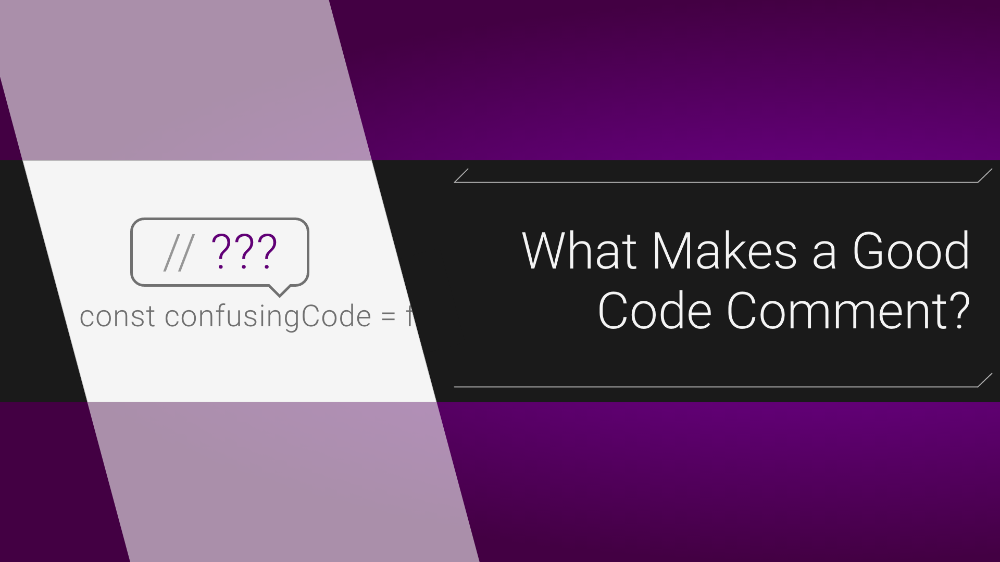

# Chapter 4: Comments

**Table of Contents:**

- [Chapter 4: Comments](#chapter-4-comments)
  - [1. Comments Key Factors](#1-comments-key-factors)
    - [1.1. Comments Do Not Make Up for Bad Code](#11-comments-do-not-make-up-for-bad-code)
    - [1.2. Explain Yourself in Code (not comments)](#12-explain-yourself-in-code-not-comments)
  - [2. What attributes make good comments](#2-what-attributes-make-good-comments)
    - [2.1. Legal Comments](#21-legal-comments)
    - [2.2. Informative Comments](#22-informative-comments)
    - [2.3. Explanation of Intent (giải thích ý định)](#23-explanation-of-intent-giải-thích-ý-định)
    - [2.4. Clarification (làm rõ)](#24-clarification-làm-rõ)
    - [2.5. Warning of Consequences (cảnh báo kết quả)](#25-warning-of-consequences-cảnh-báo-kết-quả)
    - [2.6. TODO Comments](#26-todo-comments)
    - [2.7. Amplification (sự khuếch đại)](#27-amplification-sự-khuếch-đại)
    - [2.8. Javadocs in Public APIs](#28-javadocs-in-public-apis)
  - [3. What attributes are found in bad comments](#3-what-attributes-are-found-in-bad-comments)
    - [3.1. Mumbling](#31-mumbling)
    - [3.2. Redundant Comments (comment thừa)](#32-redundant-comments-comment-thừa)
    - [3.3. Misleading Comments (sai lệch)](#33-misleading-comments-sai-lệch)
    - [3.4. Mandated Comments](#34-mandated-comments)
    - [3.5. Journal Comments](#35-journal-comments)
    - [3.6. Noise Comments](#36-noise-comments)
    - [3.7. Scary Noise](#37-scary-noise)
    - [3.8. Don’t Use a Comment When You Can Use a Function or a Variable](#38-dont-use-a-comment-when-you-can-use-a-function-or-a-variable)
    - [3.9. Position Markers](#39-position-markers)
    - [3.10. Closing Brace Comments (Đóng ngoặc nhọn)](#310-closing-brace-comments-đóng-ngoặc-nhọn)
    - [3.11. Attributions and Bylines](#311-attributions-and-bylines)
    - [3.12. Commented-Out Code](#312-commented-out-code)
    - [3.13. HTML Comments](#313-html-comments)
    - [3.14. Nonlocal Information (thông tin phi tập trung)](#314-nonlocal-information-thông-tin-phi-tập-trung)
    - [3.15. Too Much Information](#315-too-much-information)
    - [3.16. Inobvious Connection](#316-inobvious-connection)
    - [3.17. Function Headers](#317-function-headers)
    - [3.18. Javadocs in Nonpublic Code](#318-javadocs-in-nonpublic-code)

- **Comment** được sử dụng để giải quyết các `thiếu sót` của chúng ta trong mã nguồn.
- Không có gì `hữu ích` bằng một `well-placed comment`.

## 1. Comments Key Factors

### 1.1. Comments Do Not Make Up for Bad Code

- Động lực, mục đích phổ biến nhất khi chúng ta viết comment đó là <mark>bad code</mark>. Điều này là khi chúng ta viết một module và ta thấy rằng nó rất `khó hiểu`, `thiếu tổ chức`. Chúng ta sẽ sinh ra một suy nghĩ trong đầu là `"Chúng ta cần phải comment mớ lộn xộn này!"` -> <mark>No</mark>, điều bạn cần làm là `clean` nó.
- Code rõ ràng, ý nghĩa với một vài comment là tốt hơn nhiều so với một đống code phức tạp, lộn xộn cùng với nhiều comment.

> <mark>“Don’t comment bad code — rewrite it.”</mark> - Brian W. Kernighan and P. J. Plaugher

### 1.2. Explain Yourself in Code (not comments)

Bạn sẽ chọn:

```java
// Check to see if the employee is eligible for full benefits
if ((employee.flags & HOURLY_FLAG) && (employee.age > 65))
```

hay

```java
if (employee.isEligibleForFullBenefits())
```

Chỉ mất `vài giây` suy nghĩ để giải thích hầu hết các ý định của bạn trong code. -> trong nhiều trường hợp, nó chỉ đơn giản là tạo ra 1 `function` = điều bạn muốn comment.


**Tóm lại:**

- Thay vì dành thời gian viết các comment giải thích cho đống code lộn xộn mà bạn viết -> hãy <mark>clean code</mark>.
- A comment should only be added to answer a question that the code can’t.


## 2. What attributes make good comments



### 2.1. Legal Comments

 Đôi khi tiêu chuẩn code của doanh nghiệp buộc chúng ta phải viết comment -> legal reasons. Ví dụ như `copyright` và `authorship statements`. (nên đặt ở đầu source file).

### 2.2. Informative Comments

- Cung cấp thông tin cơ bản bằng cách viết comment như sau:

```java
// Returns an instance of the Responder being tested.
protected abstract Responder responderInstance();
```

- Comment này đôi khi là `hữu ích`, tuy nhiên tốt hơn chúng ta nên sử dụng `tên hàm` để truyển tải các thông tin có thể => <mark>responderBeingTested</mark>.

Ví dụ sau đây sẽ tốt hơn nhiều:

```java
// format matched kk:mm:ss EEE, MMM dd, yyyy
Pattern timeMatcher = Pattern.compile("\\d*:\\d*:\\d* \\w*, \\w* \\d*, \\d*");
```

-> comment này sẽ cho biết chuỗi sau khi được format ngày giờ bằng `SimpleDateFormat` > dễ hình dung.

### 2.3. Explanation of Intent (giải thích ý định)

- Đôi khi một comment không chỉ chứa thông tin hữu ích và mục đích của việc thực hiện. Trong ví dụ sau đây chúng ta sẽ thấy một `interesting decision documented`.

Khi so sánh 2 object, người viết muốn sắp xếp những object của lớp mình **higher** object lớp khác:

```java
public int compareTo(Object o)
{
    if(o instanceof WikiPagePath)
{
    WikiPagePath p = (WikiPagePath) o;
    String compressedName = StringUtil.join(names, "");
    String compressedArgumentName = StringUtil.join(p.names, "");
    return compressedName.compareTo(compressedArgumentName);
}
    return 1; // we are greater because we are the right type.
}
```

### 2.4. Clarification (làm rõ)

- Đôi khi chúng ta cần làm cho `argument` hoặc 1 giá trị return nào đó được rõ ràng theo đúng nghĩa của nó. Nhưng 1 phần trong thư viện chuẩn hoặc trong code bạn không thay đổi được => sử dụng một <mark>clarifying comment</mark> là cần thiết.

```java
public void testCompareTo() throws Exception
{
    WikiPagePath a = PathParser.parse("PageA");
    WikiPagePath ab = PathParser.parse("PageA.PageB");
    WikiPagePath b = PathParser.parse("PageB");
    WikiPagePath aa = PathParser.parse("PageA.PageA");
    WikiPagePath bb = PathParser.parse("PageB.PageB");
    WikiPagePath ba = PathParser.parse("PageB.PageA");
    assertTrue(a.compareTo(a) == 0); // a == a
    assertTrue(a.compareTo(b) != 0); // a != b
    assertTrue(ab.compareTo(ab) == 0); // ab == ab
    assertTrue(a.compareTo(b) == -1); // a < b
    assertTrue(aa.compareTo(ab) == -1); // aa < ab
    assertTrue(ba.compareTo(bb) == -1); // ba < bb
    assertTrue(b.compareTo(a) == 1); // b > a
    assertTrue(ab.compareTo(aa) == 1); // ab > aa
    assertTrue(bb.compareTo(ba) == 1); // bb > ba
}
```

### 2.5. Warning of Consequences (cảnh báo kết quả)

Đôi khi rất hữu ích để cảnh báo các lập trình viên khác biết về những hậu quả nhất định. Ví dụ:

```java
// Don't run unless you
// have some time to kill.
public void _testWithReallyBigFile()
{
    writeLinesToFile(10000000);
    response.setBody(testFile);
    response.readyToSend(this);
    String responseString = output.toString();
    assertSubString("Content-Length: 1000000000", responseString);
    assertTrue(bytesSent > 1000000000);
}
```

```java
public static SimpleDateFormat makeStandardHttpDateFormat()
{
    //SimpleDateFormat is not thread safe,
    //so we need to create each instance independently.
    SimpleDateFormat df = new SimpleDateFormat("EEE, dd MMM yyyy HH:mm:ss z");
    df.setTimeZone(TimeZone.getTimeZone("GMT"));
    return df;
}
```

### 2.6. TODO Comments

Đôi khi cũng có lý khi để những chú thích <mark>"To do"</mark> bên trong một comment //TODO. Trong trường hợp sau đây sẽ giải thích tại sao chức năng này có `degenerate implementation` và  `what that function’s future should be`.

```java
//TODO-MdM these are not needed
// We expect this to go away when we do the checkout model
protected VersionInfo makeVersion() throws Exception
{
    return null;
}
```

- **TODO** là công việc mà lập trình viên cho rằng nên thực hiện, nhưng vì một vài lý do nên chưa thể làm vào lúc này.
- Nó có thể là một lời nhắc xóa `deprecated feature` hoặc nhắc để thực hiện một thay đổi phụ thuộc vào một `planed event`,...
- Ngày nay hầu hết cái IDE tốt đều cung cấp các cử chỉ và tính năng để định vị các `TODO comment`.

### 2.7. Amplification (sự khuếch đại)

Một comment có thể được sử dụng để khuếch đại tầm quan trọng của một cái có vẻ không quan trọng.

```java
String listItemContent = match.group(3).trim();
// the trim is real important. It removes the starting
// spaces that could cause the item to be recognized
// as another list.
new ListItemWidget(this, listItemContent, this.level + 1);
return buildList(text.substring(match.end()));
```

### 2.8. Javadocs in Public APIs

- `There is nothing quite so helpful and satisfying as a well-described public API`. Các javadocs cho thư viện chuẩn Java là một trường hợp điển hình. Sẽ rất khó viết các chương trình java mà k có nó.
- Nếu bạn đang viết một `public API`, thì bạn thực sự nên viết `good javadocs` cho nó.

> Lưu ý: javadocs có thể chỉ gây hiểu lầm, không tập trung, không trung thực bằng các loại comment nào khác.

**Tổng kết lại:**



- Hiểu được những điều này sẽ giúp bạn biết cách để viết ra những comment tốt.
- Giúp cho người khác hiểu được code của mình là một phần rất quan trọng để trở thành một **great developer**
- Comments should just be another tool in your belt.



## 3. What attributes are found in bad comments

 Hầu hết các comment đều rơi vào mục này. Thường những comment đó là `"cái nạng"` hoặc `lời bào chữa` cho những `poor code` hoặc để biện minh cho các `insufficient decisions`.

### 3.1. Mumbling

- Nếu bạn quyết định viết một comment, hãy dành một khoảng `thời gian cần thiết` để đảm bảo rằng nó là nhận xét tốt nhất mà bạn viết.

Comment trong ví dụ sau có thể thực sự đã rất hữu ích, nhưng vì tác giả đã `vội vàng`, `không chú ý nhiều` -> his mumbling đã để lại 1 enigma (bí ẩn).

```java
public void loadProperties()
{
try
    {
        String propertiesPath = propertiesLocation + "/" + PROPERTIES_FILE;
        FileInputStream propertiesStream = new FileInputStream(propertiesPath);
        loadedProperties.load(propertiesStream);
    }
    catch(IOException e)
        {
        // No properties files means all defaults are loaded
        }
}
```

- Comment trong khối catch có nghĩa là gì? Rõ ràng khi chúng ta có exception -> no properties file, all defaults được load. Nhưng ai load những default đó, nó được load trước hay sau khi gọi **loadProperties.load**? hay **loadProperties.load** đã load all defaults trước khi thử load file?,... => khá mơ hồ.

-> Cách duy nhất là kiểm tra code trong các phần khác của hệ thống để tìm hiểu những gì đang diễn ra.

- Nếu có comment buộc chúng ta phải tìm hiểu ý nghĩa của nó thông qua các module khác -> bạn đã thất bại.

### 3.2. Redundant Comments (comment thừa)

Ví dụ 1: `waitForClose`

```java
// Utility method that returns when this.closed is true. Throws an exception
// if the timeout is reached.
public synchronized void waitForClose(final long timeoutMillis)
throws Exception
{
    if(!closed)
    {
        wait(timeoutMillis);
        if(!closed)
            throw new Exception("MockResponseSender could not be closed");
    }
}
```

-> 1 function đơn giản với 1 comment tiêu đề hoàn toàn `dư thừa`. Comment có lẻ mất nhiều thời gian để đọc hơn bản thân code.

Ví dụ 2: `ContainerBase.java` ( Lấy từ Tomcat)

```java
public abstract class ContainerBase
implements Container, Lifecycle, Pipeline,
MBeanRegistration, Serializable {
    /**
    * The processor delay for this component.
    */
    protected int backgroundProcessorDelay = -1;
    /**
    * The lifecycle event support for this component.
    */
    protected LifecycleSupport lifecycle =
    new LifecycleSupport(this);
    /**
    * The container event listeners for this Container.
    */
    protected ArrayList listeners = new ArrayList();
    /**
    * The Loader implementation with which this Container is
    * associated.
    */
    protected Loader loader = null;
    /**
    * The Logger implementation with which this Container is
    * associated.
    */
    protected Log logger = null;
    /**
    * Associated logger name.
    */
    protected String logName = null;
}
```

- Những comment này chỉ làm lộn xộn, làm tối code, hoàn toàn không có mục đích tài liệu nào cả.

### 3.3. Misleading Comments (sai lệch)

Nhìn lại ví dụ 1 ở trên ta thấy sự sai lệch trong comment.

```java
// Utility method that returns when this.closed is true. Throws an exception
// if the timeout is reached.
public synchronized void waitForClose(final long timeoutMillis)
throws Exception
{
    if(!closed)
    {
        wait(timeoutMillis);
        if(!closed)
            throw new Exception("MockResponseSender could not be closed");
    }
}
```

> Did you discover how the comment was misleading? The method does not return
when this.closed becomes true. It returns if this.closed is true; otherwise, it waits for a
blind time-out and then throws an exception if this.closed is still not true.

Một chút thông tin sai lệch tinh vi này nằm trong một comment khó đọc hơn phần thân code -> khiến cho người khác hiểu sai ý -> thực thi lỗi.

### 3.4. Mandated Comments

Thật là ngớ ngẩn khi có một `quy tắc` nói rằng mọi hàm phải có javadoc hoặc mọi biến phải có một nhận xét. Những bình luận như thế này chỉ làm code lộn xộn dẫn đến sự mơ hồ và không tổ chức.

Ví dụ: required javadocs cho mỗi function.

```java
/**
*
* @param title The title of the CD
* @param author The author of the CD
* @param tracks The number of tracks on the CD
* @param durationInMinutes The duration of the CD in minutes
*/
public void addCD(String title, String author,
int tracks, int durationInMinutes) {
    CD cd = new CD();
    cd.title = title;
    cd.author = author;
    cd.tracks = tracks;
    cd.duration = duration;
    cdList.add(cd);
}
```

### 3.5. Journal Comments

- Mọi người thường thêm nhận xét vào đầu module mỗi lần họ chỉnh sửa nó. Những comment này tích lũy như `kind of journal` hoặc `log` của mọi thay đổi đã được thực hiện.

```java
* Changes (from 11-Oct-2001)
* --------------------------
* 11-Oct-2001 : Re-organised the class and moved it to new package
* com.jrefinery.date (DG);
* 05-Nov-2001 : Added a getDescription() method, and eliminated NotableDate
* class (DG);
* 12-Nov-2001 : IBD requires setDescription() method, now that NotableDate
* class is gone (DG); Changed getPreviousDayOfWeek(),
* getFollowingDayOfWeek() and getNearestDayOfWeek() to correct
* bugs (DG);
* 05-Dec-2001 : Fixed bug in SpreadsheetDate class (DG);
* 29-May-2002 : Moved the month constants into a separate interface
* (MonthConstants) (DG);
* 27-Aug-2002 : Fixed bug in addMonths() method, thanks to N???levka Petr (DG);
* 03-Oct-2002 : Fixed errors reported by Checkstyle (DG);
* 13-Mar-2003 : Implemented Serializable (DG);
* 29-May-2003 : Fixed bug in addMonths method (DG);
* 04-Sep-2003 : Implemented Comparable. Updated the isInRange javadocs (DG);
* 05-Jan-2005 : Fixed bug in addYears() method (1096282) (DG);
```

- Trước đây có lý do chính đáng để tạo ra các mục log này khi bắt đầu mỗi module. Chúng ta đã không có các hệ thống để kiểm soát mã nguồn làm điều này cho chúng ta. Tuy nhiên, bây giờ những cái `journals` này chỉ làm cho module lộn xộn hơn. -> chúng ta nên loại bỏ hoàn toàn.

### 3.6. Noise Comments

Đôi khi bạn thấy có những comment chỉ nói lại những điều đã rõ ràng chẳng cung cấp thông tin gì mới.

```java
/**
* Default constructor.
*/
protected AnnualDateRule() {
}
```

```java
/**
* Returns the day of the month.
*
* @return the day of the month.
*/
public int getDayOfMonth() {
    return dayOfMonth;
}
```

```java
private void startSending()
{
try
{
doSending();
}
catch(SocketException e)
{
// normal. someone stopped the request.
}
catch(Exception e)
{
try
{
response.add(ErrorResponder.makeExceptionString(e));
response.closeAll();
}
catch(Exception e1)
{
//Give me a break!
}
}
}
```

- Comment đầu tiên trong ví dụ này có vẻ phù hợp, nó giải thích khối catch bị bỏ qua. Nhưng ở comment thứ 2 thì thật sự là `noise` - Có lẽ người viết cảm thấy rất mệt mỏi khi viết những khối try/catch trong function này.

-> Thay vì trút giận vào những comment vô giá trị và `"ồn ào"` đó thì người viết nên nhận ra anh ta có thể giải quyết sự thất vọng đó bằng cách `cải tiến` cấu trúc code.

**Giải pháp:**

```java
private void startSending()
{
    try
    {
        doSending();
    }
    catch(SocketException e)
    {
        // normal. someone stopped the request.
    }
    catch(Exception e)
    {
        addExceptionAndCloseResponse(e);
    }
}

private void addExceptionAndCloseResponse(Exception e)
{
    try
    {
        response.add(ErrorResponder.makeExceptionString(e));
        response.closeAll();
    }
    catch(Exception e1)
    {

    }
}
```

### 3.7. Scary Noise

Javadocs cũng có thể `noisy`. Ví dụ Javadocs từ một nguồn thư viện mở nổi tiếng

```java
/** The name. */
private String name;
/** The version. */
private String version;
/** The licenceName. */
private String licenceName;
/** The version. */
private String info;
```

Đọc kỹ lại lần nữa những comment ta sẽ thấy lỗi `cut-paste`. Nếu người viết không chú ý khi viết (hoặc pasted) những comment này, -> `why should readers be expected to profit from them?`

### 3.8. Don’t Use a Comment When You Can Use a Function or a Variable

Xem xét đoạn code sau:

```java
// does the module from the global list <mod> depend on the
// subsystem we are part of?
if (smodule.getDependSubsystems().contains(subSysMod.getSubSystem()))
```

Chúng ta nên cấu trúc lại code mà không cần dùng comment như sau:

```java
ArrayList moduleDependees = smodule.getDependSubsystems();
String ourSubSystem = subSysMod.getSubSystem();
if (moduleDependees.contains(ourSubSystem))
```

### 3.9. Position Markers

Đôi khi lập trình viên muốn đánh dấu một vị trí nào đó trong source file. Ví dụ:

```java
// Actions //////////////////////////////////
```

Có những lúc hiếm hoi những comment này có ý nghĩa khi được tập hợp lại như 1 banner -> nên sử dụng `chỉ khi` có lợi ích lớn -> còn không thì bỏ qua.

### 3.10. Closing Brace Comments (Đóng ngoặc nhọn)

Đôi khi các lập trình viên sẽ đưa ra những comment đặc biệt về đóng dấu ngoặc. Mặc dù điều này có ý nghĩa đối với những hàm dài với các cấu trúc lồng nhau sâu. Nhưng nó sẽ rất lộn xộn với những hàm nhỏ. => Bạn nên `rút ngắn function` thay vì muốn comment đánh dấu việc đóng dấu ngoặc.

Ví dụ: `wc.java`

```java
public class wc {
    public static void main(String[] args) {
        BufferedReader in = new BufferedReader(new InputStreamReader(System.in));
        String line;
        int lineCount = 0;
        int charCount = 0;
        int wordCount = 0;
        try {
            while ((line = in.readLine()) != null) {
                lineCount++;
                charCount += line.length();
                String words[] = line.split("\\W");
                wordCount += words.length;
            } //while
            System.out.println("wordCount = " + wordCount);
            System.out.println("lineCount = " + lineCount);
            System.out.println("charCount = " + charCount);
        } // try
        catch (IOException e) {
            System.err.println("Error:" + e.getMessage());
        } //catch
    } //main
}
```

### 3.11. Attributions and Bylines

```java
/* Added by Tien */
```

- Hệ thống kiểm soát mã nguồn rất tốt trong việc ghi nhớ ai đã thêm cái gì, khi nào. -> không cần thêm comment.
- Bạn nghĩ rằng những comment như vậy sẽ hữu ích để giúp người khác biết ai làm việc với code. Nhưng thực tế họ có xu hướng ở lại trong nhiều năm, `getting less and less accurate and relevant`

### 3.12. Commented-Out Code

Ví dụ:

```java
InputStreamResponse response = new InputStreamResponse();
response.setBody(formatter.getResultStream(), formatter.getByteCount());
// InputStream resultsStream = formatter.getResultStream();
// StreamReader reader = new StreamReader(resultsStream);
// response.setContent(reader.read(formatter.getByteCount()));
```

- Những người khác sẽ thấy rằng `commented-out code` này là có một lý do và quá quan trọng nên không xóa nó. -> `lộn xộn`.

### 3.13. HTML Comments

- Nhúng **HTML** vào source code comment là `abomination` (sự xấu xí, gớm ghiếc) - bạn có thể thấy điều này thông qua ví dụ bên dưới.
- Làm cho comment trở nên khó đọc hơn.

```java
/**
* Task to run fit tests.
* This task runs fitnesse tests and publishes the results.
* <p/>
* <pre>
* Usage:
* &lt;taskdef name=&quot;execute-fitnesse-tests&quot;
* classname=&quot;fitnesse.ant.ExecuteFitnesseTestsTask&quot;
* classpathref=&quot;classpath&quot; /&gt;
* OR
* &lt;taskdef classpathref=&quot;classpath&quot;
* resource=&quot;tasks.properties&quot; /&gt;
* <p/>
* &lt;execute-fitnesse-tests
* suitepage=&quot;FitNesse.SuiteAcceptanceTests&quot;
* fitnesseport=&quot;8082&quot;
* resultsdir=&quot;${results.dir}&quot;
* resultshtmlpage=&quot;fit-results.html&quot;
* classpathref=&quot;classpath&quot; /&gt;
* </pre>
*/
```

### 3.14. Nonlocal Information (thông tin phi tập trung)

- Nếu bạn phải viết comment - hãy chắc rằng nó mô tả cho code ở `gần đó`.
- Đừng cung cấp thông tin toàn hệ thống trong 1 `local comment`.

Ví dụ:

```java
/**
* Port on which fitnesse would run. Defaults to <b>8082</b>.
*
* @param fitnessePort
*/
public void setFitnessePort(int fitnessePort)
{
    this.fitnessePort = fitnessePort;
}
```

- Comment cung cấp thông tin port mặc định, nhưng function hoàn toàn không kiểm soát giá trị port mặc định, không được mô tả chức năng với comment đó.
- Dĩ nhiên không ai đảm bảo rằng comment sẽ thay đổi khi giá trị default bị thay đổi.

### 3.15. Too Much Information

- Đừng đưa những cuộc `thảo luận` thú vị trong lịch sử hay những `mô tả chi tiết` không liên quan vào comment của bạn.

Ví dụ: Trích từ 1 module được thiết kế để test function có encode và decode `base64`.

```java
/*
RFC 2045 - Multipurpose Internet Mail Extensions (MIME)
Part One: Format of Internet Message Bodies
section 6.8. Base64 Content-Transfer-Encoding
The encoding process represents 24-bit groups of input bits as output
strings of 4 encoded characters. Proceeding from left to right, a
24-bit input group is formed by concatenating 3 8-bit input groups.
These 24 bits are then treated as 4 concatenated 6-bit groups, each
of which is translated into a single digit in the base64 alphabet.
When encoding a bit stream via the base64 encoding, the bit stream
must be presumed to be ordered with the most-significant-bit first.
That is, the first bit in the stream will be the high-order bit in
the first 8-bit byte, and the eighth bit will be the low-order bit in
the first 8-bit byte, and so on.
*/
```

### 3.16. Inobvious Connection

- Sự liên kết giữa comment và code mà nó mô tả nên được `rõ ràng`, `rành mạch`.

Xem xét ví dụ sau trích từ apache commons:

```java
/*
* start with an array that is big enough to hold all the pixels
* (plus filter bytes), and an extra 200 bytes for header info
*/
this.pngBytes = new byte[((this.width + 1) * this.height * 3) + 200];
```

- What is a filter byte? Does it relate to the +1? Or to the *3? Both? Is a pixel a byte? Why 200?.
- Mục đích của một comment là để `giải thích code` không giải thích chính nó.

### 3.17. Function Headers

- Các hàm ngắn `không` cần mô tả nhiều.
- Chọn một cái tên tốt để đặt cho function hơn là sử dụng 1 `comment header`.

### 3.18. Javadocs in Nonpublic Code

Việc tạo các trang javadoc cho các lớp và hàm bên trong hệ thống nói chung không hữu ích và hình thức bổ sung của số lượng bình luận javadoc ít hơn nhiều so với `cruft` và `distraction`.
