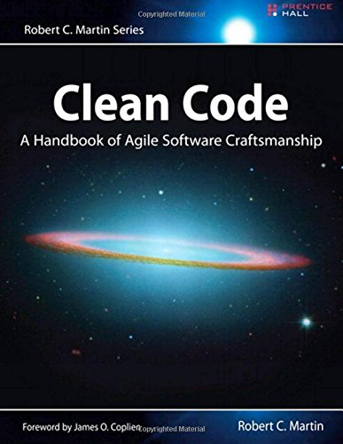

# Clean Code: A Handbook of Agile Software Craftsmanship

## Table of content

* [Chapter 1: Clean Code](chapter1.md) - *tuyenld*
* [Chapter 2: Meaningful Names](chapter2.md) - *tuyenld*
* [Chapter 3: Functions - tuyenld](chapter3.md) - *tuyenld*
* [Chapter 4: Comments](chapter4.md) - *tienmvn*
* [Chapter 5: Formatting](chapter5.md) - *tienmvn*
* [Chapter 6: Objects and Data Structures](chapter6.md) - *tienmvn*
* [Chapter 7: Error Handling](chapter7.md) - *hautc*
* [Chapter 8: Boundaries](chapter8.md) - *hautc*
* [Chapter 9: Unit Tests](chapter9.md) - *hautc*
* [Chapter 10: Classes](chapter10.md) - *huync*
* [Chapter 11: Systems](chapter11.md) - *huync*
* [Chapter 12: Emergence](chapter12.md) - *huync*
* [Chapter 13: Concurrency](chapter13.md) - *khoadd*
* [Chapter 14: Successive Refinement](chapter14.md) - *trungdn*
* [Chapter 15: JUnit Internals](chapter15.md) - *khoadd*
* [Chapter 16: Refactoring SerialDate](chapter16.md) - *phuctt*
* [Chapter 17: Smells and Heuristics](chapter17.md) - *phuctt*
